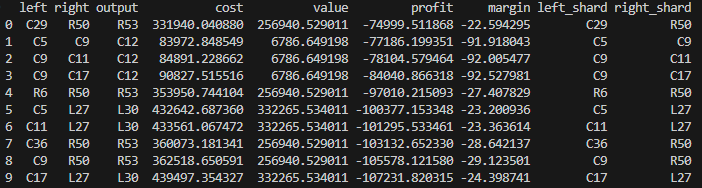

## Project Description
(Showcase of what is currently made still fully in development for this logic behind special fusions.)
A data-driven shard fusion system built for the Hypixel SkyBlock server.
This project analyzes shard fusion rules to determine which shard combinations yield the highest resale profit on the Bazaar.

Rather than simulating gameplay, the engine focuses on economic optimization:
Which two shards should be bought, fused, and resold for maximum profit?

Heres a current example of the CLI output using the fusion logic of base shards
(WIP/Special fusion logic not implemented)

# Overview
This engine is designed to plug into:
- Bazaar price scraping
- Historical pricing analysis
- Automated shard-flipping tools

# Typical workflow:
- Pull live Bazaar prices
- Evaluate fusion outputs
- Compare input cost vs output resale value
- Rank shard pairs by expected profit

# Rules
This system is built like a rule engine, not a lookup table.
Fusion behavior is defined in JSON, not Python
Adding new shards or rules requires zero code changes
Fusion resolution mirrors in-game behavior, including:
- Skipped outputs
- Base-fusion precedence
- Output limits
This makes the engine:
- Extensible
- Testable
- Suitable for automation and data analysis

##