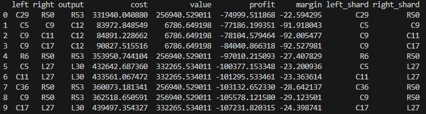

## Project Description
A data-driven shard fusion profit calculator built for the Hypixel SkyBlock server.

This project analyzes shard fusion rules — both base and special — to determine which shard combinations yield the highest resale profit on the Bazaar.

Rather than simulating gameplay, the engine focuses on economic optimization:
Which two shards should be bought, fused, and resold for maximum profit?

## Overview
The engine pulls live Bazaar prices and evaluates every valid shard pair, ranking them by expected profit after tax.

It handles two fusion systems:
- **Base fusions** — standard rarity/category-based fusion resolution
- **Special fusions** — rule-driven overrides defined in JSON (family, rarity thresholds, specific shards, etc.)

## Typical Workflow
1. Pull live Bazaar prices from the Hypixel API
2. Evaluate all valid fusion combinations
3. Compare input cost vs output resale value
4. Rank shard pairs by expected profit

## Architecture
Fusion behavior is defined in JSON, not hardcoded in Python. Adding new shards or rules requires zero code changes.

Key files:
- `base_fusion_algo.py` — base fusion resolution and profit scanner
- `special_fusion_algo.py` — special fusion rule engine and evaluate function
- `bazaar_api_integration.py` — Hypixel Bazaar API integration
- `shard_data.json` — shard definitions (name, rarity, category, family, fusion count)
- `special_fusions.json` — special fusion rules
